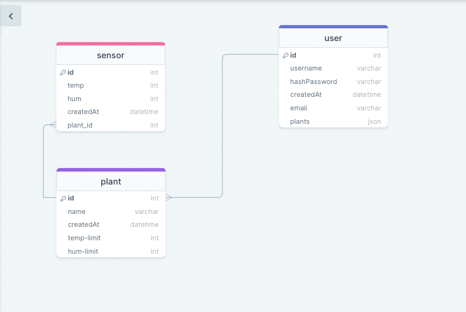

<p align="center">
  <a href="http://nestjs.com/" target="blank"></a>
  <a href="" target="blank"></a>

</p>

  <p align="center">A progressive <a href="http://nodejs.org" target="_blank">Node.js</a> framework for building efficient and scalable server-side applications.
Created by uemrecelik for Yasar University Term Project</p>
    <p align="center">
<a href="https://www.npmjs.com/~nestjscore" target="_blank"></a>
<a href="https://www.npmjs.com/~nestjscore" target="_blank"></a>
<a href="https://circleci.com/gh/nestjs/nest" target="_blank"></a>
<a href="https://coveralls.io/github/nestjs/nest?branch=master" target="_blank"></a>
<a href="https://opencollective.com/nest#backer" target="_blank"></a>
</p>
## Description

[Nest](https://github.com/nestjs/nest) framework TypeScript starter repository.
Server side application for Yasar University Term project.
This api store routes of sensor and user datas.

## Installation

```bash
$ npm install
```

## Running the app

```bash
# development
$ npm run start

# watch mode
$ npm run start:dev

# production mode
$ npm run start:prod
```

## Test

```bash
# unit tests
$ npm run test

# e2e tests
$ npm run test:e2e

# test coverage
$ npm run test:cov
```

## Stay in touch

- Author - [Umut Emre Celik](https://www.linkedin.com/public-profile/settings?trk=d_flagship3_profile_self_view_public_profile)


## License

[MIT licensed](LICENSE).

## Diagrams
<a href="" target="blank"></a>

<a href="" target="blank"></a>


